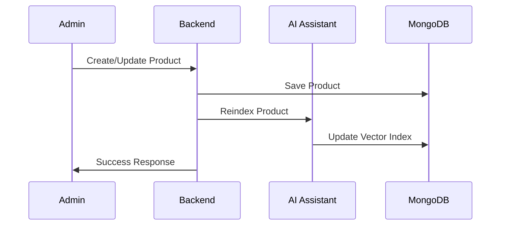
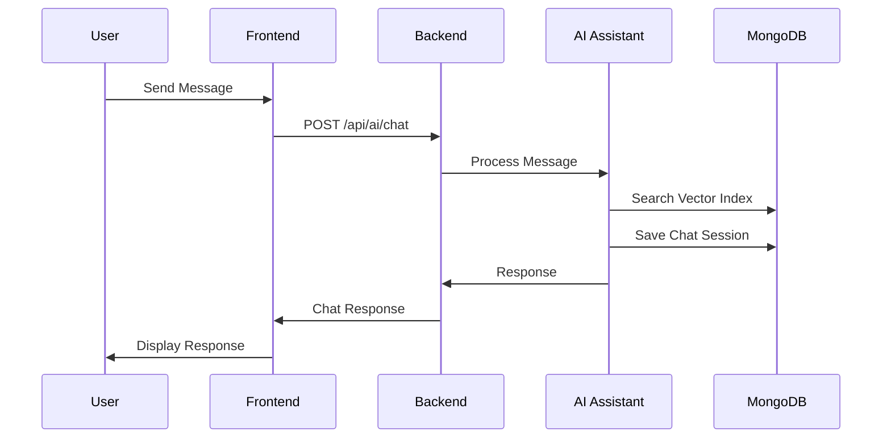
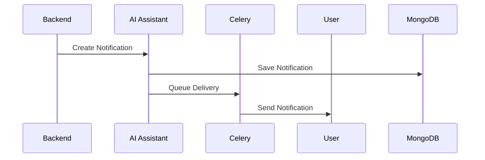

# AI Assistant Integration Guide

This guide explains how to integrate the Python AI Assistant with your existing Node.js backend for the clothing brand.

## 🏗️ Architecture Overview

```
┌─────────────────┐    ┌─────────────────┐    ┌─────────────────┐
│   Frontend      │    │  Node.js Backend│    │ Python AI       │
│   (React)       │◄──►│  (Port 3001)    │◄──►│  Assistant      │
│                 │    │                 │    │  (Port 8000)    │
└─────────────────┘    └─────────────────┘    └─────────────────┘
                              │                        │
                              ▼                        ▼
                       ┌─────────────────┐    ┌─────────────────┐
                       │   MongoDB       │    │   Redis         │
                       │   (Shared DB)   │    │   (Celery)      │
                       └─────────────────┘    └─────────────────┘
```

## 📋 Prerequisites

1. **MongoDB** - Shared database for both systems
2. **Redis** - For Celery background tasks
3. **Node.js** - For the backend
4. **Python 3.8+** - For the AI assistant

## 🚀 Quick Setup

### 1. Install Dependencies

```bash
# Backend dependencies
cd Backend
npm install

# AI Assistant dependencies
cd ../ai_assistant
pip install -r requirements.txt
```

### 2. Configure Environment

```bash
# Backend environment
cp Backend/env.example Backend/.env
# Edit Backend/.env with your configuration

# AI Assistant environment
cp ai_assistant/env.example ai_assistant/.env
# Edit ai_assistant/.env with your configuration
```

### 3. Start Services

```bash
# Option 1: Use the integrated startup script
chmod +x start_integrated_system.sh
./start_integrated_system.sh

# Option 2: Start manually
# Terminal 1: Start MongoDB
mongod

# Terminal 2: Start Redis
redis-server

# Terminal 3: Start AI Assistant
cd ai_assistant
python run.py

# Terminal 4: Start Celery worker
cd ai_assistant
celery -A ai_assistant.tasks.celery_tasks worker --loglevel=info

# Terminal 5: Start Celery beat
cd ai_assistant
celery -A ai_assistant.tasks.celery_tasks beat --loglevel=info

# Terminal 6: Start Backend
cd Backend
npm start
```

## 🔗 Integration Points

### 1. Database Integration

Both systems share the same MongoDB database:

- **Collections**: `products`, `orders`, `users`, `chat_sessions`, `notifications`
- **Vector Collections**: `vector_index`, `vector_mapping`

### 2. API Integration

The Node.js backend communicates with the AI assistant via HTTP:

```javascript
// Example: Send chat message
const response = await aiAssistantService.sendChatMessage(
    "I'm looking for a blue shirt",
    userId,
    sessionId
);
```

### 3. Automatic Reindexing

When data changes in the backend, it automatically reindexes in the AI assistant:

```javascript
// Product creation/update triggers reindex
await aiAssistantService.autoReindexOnChange('products', productId);

// Order status change triggers reindex
await aiAssistantService.autoReindexOnChange('orders', orderId);
```

## 📡 API Endpoints

### Backend AI Integration Routes (`/api/ai`)

| Method | Endpoint | Description | Auth Required |
|--------|----------|-------------|---------------|
| POST | `/chat` | Send chat message | ✅ |
| GET | `/chat/session/:sessionId` | Get chat history | ✅ |
| GET | `/search` | Semantic search | ❌ |
| GET | `/notifications` | Get user notifications | ✅ |
| PUT | `/notifications/:id/read` | Mark notification read | ✅ |
| GET | `/admin/stats` | System statistics | ✅ (Admin) |
| POST | `/admin/reindex` | Reindex specific data | ✅ (Admin) |
| POST | `/admin/reindex/full` | Full reindex | ✅ (Admin) |
| GET | `/health` | Health check | ❌ |

### AI Assistant Direct Routes (`http://localhost:8000`)

| Method | Endpoint | Description |
|--------|----------|-------------|
| POST | `/chat` | Direct chat access |
| GET | `/search` | Direct search access |
| POST | `/notifications` | Create notifications |
| GET | `/docs` | API documentation |

## 🔄 Data Flow

### 1. Product Management



### 2. Chat Interaction



### 3. Notification System



## 🛠️ Configuration

### Backend Environment Variables

```env
# AI Assistant Configuration
AI_ASSISTANT_URL=http://localhost:8000

# Database Configuration
MONGODB_URL=mongodb://localhost:27017
DB_NAME=clothing_brand

# JWT Configuration
JWT_SECRET=your_jwt_secret_here
JWT_EXPIRE=30d
```

### AI Assistant Environment Variables

```env
# Database Configuration
MONGODB_URL=mongodb://localhost:27017
DB_NAME=clothing_brand

# Embedding Model
EMBEDDING_MODEL=sentence-transformers/all-MiniLM-L6-v2

# Redis Configuration
REDIS_URL=redis://localhost:6379

# OpenAI (Optional)
OPENAI_API_KEY=your_openai_api_key_here
```

## 📊 Monitoring

### Health Checks

```bash
# Backend health
curl http://localhost:3001/api/ai/health

# AI Assistant health
curl http://localhost:8000/health

# System stats (admin only)
curl http://localhost:3001/api/ai/admin/stats
```

### Logs

```bash
# Backend logs
tail -f logs/backend.log

# AI Assistant logs
tail -f logs/ai_assistant.log

# Celery logs
tail -f logs/celery_worker.log
tail -f logs/celery_beat.log
```

## 🔧 Troubleshooting

### Common Issues

1. **AI Assistant Not Available**
   ```bash
   # Check if AI assistant is running
   curl http://localhost:8000/health
   
   # Check logs
   tail -f logs/ai_assistant.log
   ```

2. **Vector Index Issues**
   ```bash
   # Rebuild vector index
   curl -X POST http://localhost:8000/index/full
   ```

3. **MongoDB Connection Issues**
   ```bash
   # Check MongoDB status
   mongo --eval "db.adminCommand('ping')"
   ```

4. **Redis Connection Issues**
   ```bash
   # Check Redis status
   redis-cli ping
   ```

### Performance Optimization

1. **Vector Index**: Use GPU-accelerated FAISS for large datasets
2. **Caching**: Implement Redis caching for frequent queries
3. **Database**: Optimize MongoDB indexes
4. **Async Processing**: Use background tasks for heavy operations

## 🧪 Testing

### Test the Integration

```bash
# Test AI assistant
cd ai_assistant
python test_system.py

# Test backend integration
curl -X POST http://localhost:3001/api/ai/chat \
  -H "Content-Type: application/json" \
  -H "Authorization: Bearer YOUR_TOKEN" \
  -d '{"message": "Hello", "sessionId": "test"}'

# Test semantic search
curl "http://localhost:3001/api/ai/search?query=blue%20shirt&top_k=5"
```

## 📈 Scaling Considerations

1. **Load Balancing**: Use nginx for multiple AI assistant instances
2. **Database**: Consider MongoDB Atlas for production
3. **Caching**: Implement Redis cluster for high availability
4. **Monitoring**: Use tools like PM2 for Node.js and Supervisor for Python

## 🔒 Security

1. **Authentication**: All sensitive endpoints require JWT tokens
2. **Authorization**: Admin endpoints require admin role
3. **Rate Limiting**: Implement rate limiting for chat endpoints
4. **Input Validation**: Validate all inputs before processing

## 📚 Additional Resources

- [AI Assistant Documentation](ai_assistant/README.md)
- [Backend API Documentation](Backend/README.md)
- [FastAPI Documentation](http://localhost:8000/docs)
- [Celery Documentation](https://docs.celeryproject.org/)

---

**Note**: This integration provides a seamless experience where the AI assistant enhances your existing backend with intelligent features while maintaining the same API structure for your frontend. 